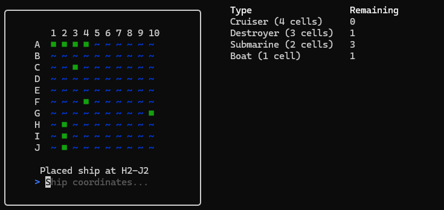
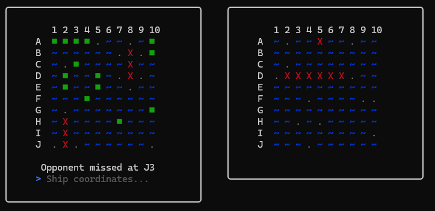

## Seawar

Terminal game build with Golang

## Play

``go run main.go``

## First phase: Ship placement

### Horizontal
* Input can be one cell - C3

* For ships with more than one cell - A1-A4 *(NB! A1 and A4 included, A4-A1 also valid)*

### Vertical

* H2-J2 *(NB! H2 and J2 included, J2-H2 also valid)*

## AI logic

There are two main strategy:

* Target mode - Random shot
* Hunt mode - If any ship was hit, shot adjacent cells

## Game

Left board: Your board

Right board: Your shots on opponents board